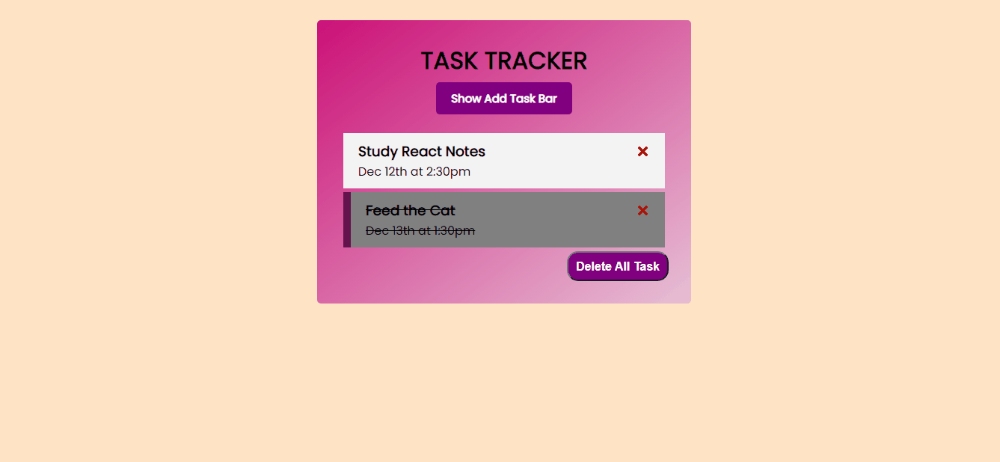

# Task Tracker

## Description

Project aims to create a Task Tracker App.


## Project Skeleton

```
Task Tracker 
|
|----readme.md         # Given to the students (Definition of the project)
SOLUTION
├── public
│     └── index.html
├── src
│    ├── components
│    │       ├── Header.js
│    │       │     └── Button.js
│    │       │   
│    │       ├── AddTask.js
│    │       │   
│    │       │   
│    │       └── Tasks.js
│    │             └── Task.js
│    │            
│    ├── App.js
│    ├── App.css
│    ├── index.js
│    └── index.css
├── package.json
└── yarn.lock
```


## Objective

Build a Task Tracker App using ReactJS.





